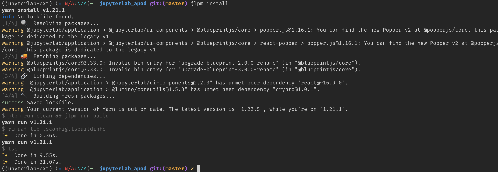
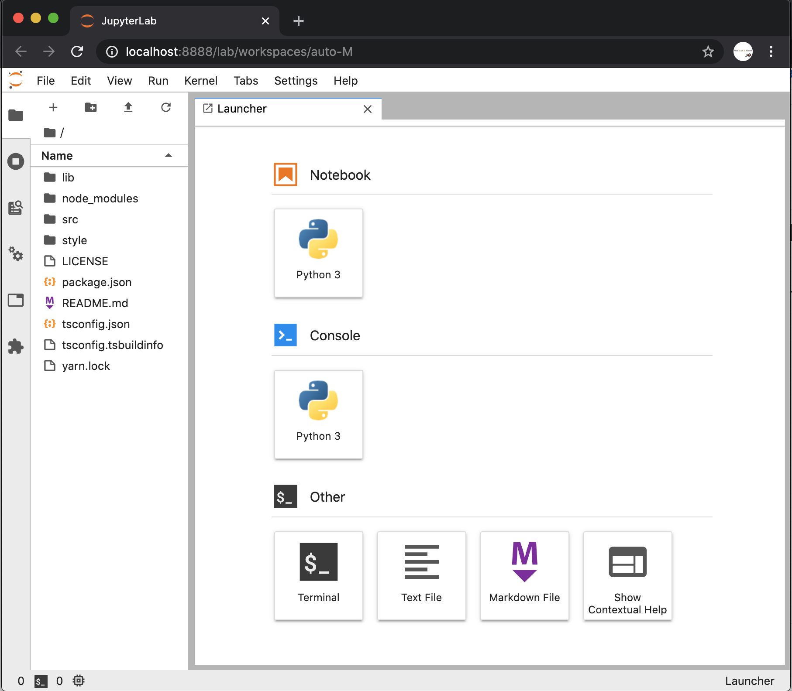
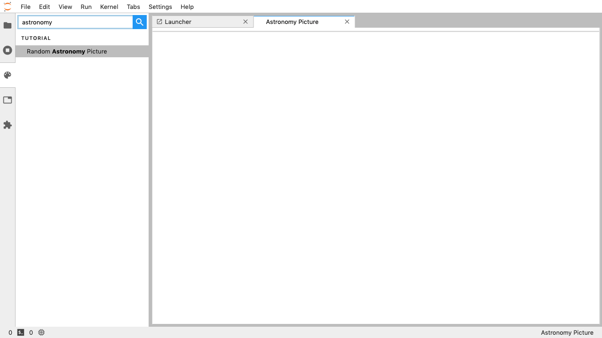
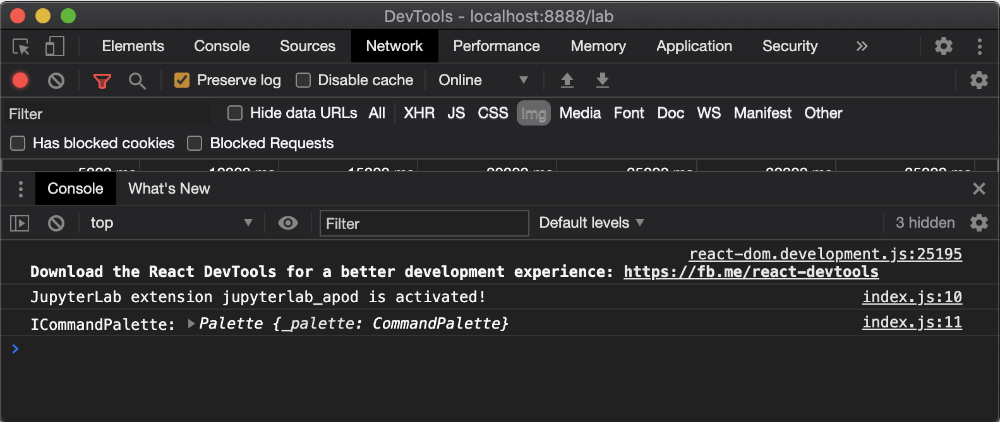
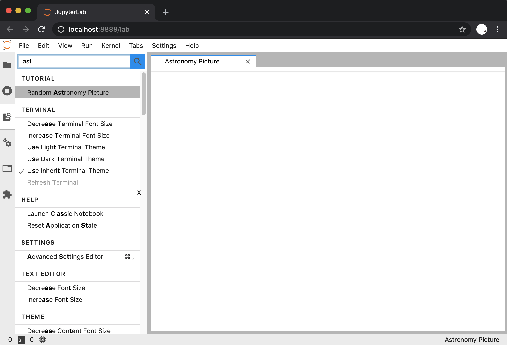
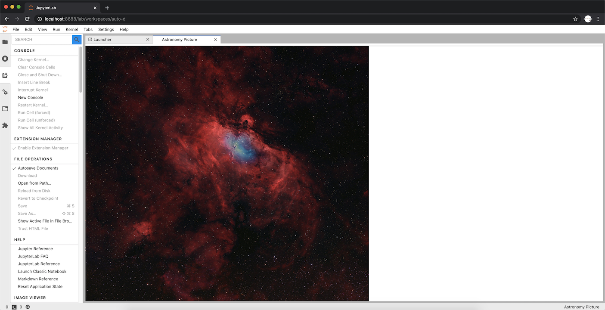
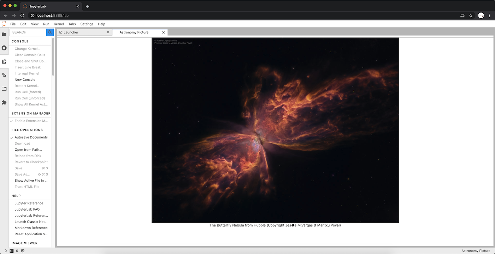
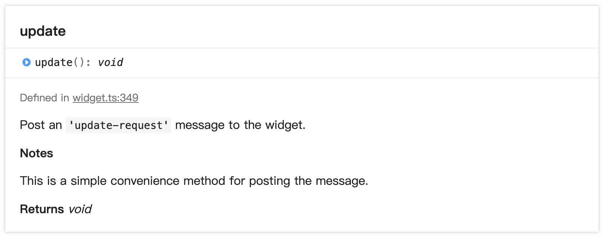

# 跟著官方手冊開發 JupyterLab Extension

> JupyterLab is a next-generation web-based user interface for Project Jupyter.

使用者能在 JupyterLab 安裝新的 Extension 來擴充它的功能，對於進階的使用者可以透過實作或改寫既有的 Extension 來滿足特別的需求。特別是將 JupyterLab 視為類 IDE 的開發者而言，能透過實作自己的 Extension 來提供特定領域需求的開發者體驗。

例如：[替機器學習領域挑選的 19 個最佳 Extension](https://neptune.ai/blog/jupyterlab-extensions-for-machine-learning)，就是為了將手上的 JupyterLab 配置成適於機器學習之用。當你在既有的 Extension 找不到想要的功能，或是覺得能替它改善點什麼的時候，那就是進入 Extension 開發的好時機。

在 JupyterLab 官方手冊有提供 [Extension 開發教學](https://jupyterlab.readthedocs.io/en/stable/developer/extension_tutorial.html#extension-tutorial)，目標是實作一個顯示天文圖片的頁面。我們就跟著他做看看唄！

## 建立開發環境

為了要能開發 JupyterLab 要建立出一組新的 conda 環境 (conda 當然要先裝好，這就不另外介紹囉)，以下是文件中提供的參考指令：

```bash
conda create -n jupyterlab-ext \
--override-channels --strict-channel-priority \
-c conda-forge -c anaconda jupyterlab cookiecutter nodejs git
```

執行完它後，就會獲得一組新的 `jupyterlab-ext` 環境，可以用 env list 檢查看看：

```bash
$ conda env list
# conda environments:
#
base                  *  /Users/qrtt1/anaconda3
jupyterlab-ext           /Users/qrtt1/anaconda3/envs/jupyterlab-ext
jupyterlab-master        /Users/qrtt1/anaconda3/envs/jupyterlab-master
```

標上 `*` 的那列是目前使用的 conda 環境，記得在開發時得先啟用它：

```bash
$ conda activate jupyterlab-ext
(jupyterlab-ext) $
```

## 建立專案骨架

[cookiecutter](https://github.com/cookiecutter/cookiecutter) 是專案產生工具，可以指定一個專案範本給它，它透過互動問答取得參取，最後建立出專案的骨架：

```bash
cookiecutter https://github.com/jupyterlab/extension-cookiecutter-ts
```

依手冊上的流程輸必要的參數：

- Extension 名稱
- 是否有 server extension：目前先選 No，實務上建議選 Yes，因為事後加的動作比較鎖碎。

```bash
You've downloaded /Users/qrtt1/.cookiecutters/extension-cookiecutter-ts before. Is it okay to delete and re-download it? [yes]: yes
author_name []: qrtt1
extension_name [myextension]: jupyterlab_apod
project_short_description [A JupyterLab extension.]: Show a random NASA Astronomy Picture of the Day in a JupyterLab panel
has_server_extension [n]: 
has_binder [n]:
repository [https://github.com/my_name/myextension]: https://github.com/qrtt1/jupyterlab_apod
```

專案建立好後，可以在專案目錄下看到這些檔案：

```bash
(jupyterlab-ext) (⎈ N/A:N/A)➜  jupyterlab_apod git:(master) ls
LICENSE       README.md     package.json  src           style         tsconfig.json
```

在這目錄，我們要進行第 1 次安裝 (他也會順便下載相依的 library 並編譯 TypeScript)

```bash
jlpm install
```

過程可能會出現一些 warning，但只是沒出現 Error 就是成功了：



接著使用下列指令安裝 Extension：

```bash
jupyter labextension install . --no-build
```

可以使用 `labextension list` 查詢已安裝的 Extension：

```bash
(jupyterlab-ext) (⎈ N/A:N/A)➜  jupyterlab_apod git:(master) ✗ jupyter labextension list
JupyterLab v2.2.5
Known labextensions:
   app dir: /Users/qrtt1/anaconda3/envs/jupyterlab-ext/share/jupyter/lab
        jupyterlab-apod v0.1.0  enabled  OK*

   local extensions:
        jupyterlab-apod: /Users/qrtt1/temp/jupyterlab_apod
```

我們先保持著目前的 Terminal，另開一個 Terminal 在專案路徑。我們會在原有的 Terminal 執行指令，在新的 Terminal 啟動 JupyterLab：

```bash
conda activate jupyterlab-ext
jupyter lab --watch
```

啟動後，它會自動在你的瀏覽器上開啟 JupyterLab：



## 實作新功能

目前專案唯一的程式碼是在 `src/index.ts`，接下來的動作，就是修改它變更前端頁面：

```tsx
import {
  JupyterFrontEnd,
  JupyterFrontEndPlugin
} from '@jupyterlab/application';

/**
 * Initialization data for the jupyterlab_apod extension.
 */
const extension: JupyterFrontEndPlugin<void> = {
  id: 'jupyterlab-apod',
  autoStart: true,
  activate: (app: JupyterFrontEnd) => {
    console.log('JupyterLab extension jupyterlab-apod is activated!');
  }
};

export default extension;
```

依官方手冊的計劃，它打算在側欄的調色盤加一個 Command，當使用者按下時會顯示新的頁面，手冊上給的第一階段參考圖如下：



## 加入 ICommandPalette

```diff
diff --git a/src/index.ts b/src/index.ts
index c04e37d..7236cc2 100644
--- a/src/index.ts
+++ b/src/index.ts
@@ -3,14 +3,20 @@ import {
   JupyterFrontEndPlugin
 } from '@jupyterlab/application';
 
+import {
+  ICommandPalette
+} from '@jupyterlab/apputils';
+
 /**
  * Initialization data for the jupyterlab_apod extension.
  */
 const extension: JupyterFrontEndPlugin<void> = {
   id: 'jupyterlab-apod',
   autoStart: true,
-  activate: (app: JupyterFrontEnd) => {
-    console.log('JupyterLab extension jupyterlab-apod is activated!');
+  requires: [ICommandPalette],
+  activate: (app: JupyterFrontEnd, palette: ICommandPalette) => {
+    console.log('JupyterLab extension jupyterlab_apod is activated!');
+    console.log('ICommandPalette:', palette);
   }
 };
```

JupyterFrontEndPlugin 是 Extension 的程式進入點，它必需提供 activate 函式以初始化 Extension。這一次的修改，增加 requires 欄位，將 ICommandPalette 介面指定進去，並修改 activate 參數增加 ICommandPalette 型別的 palette 變數。這樣一來，我們的啟動程序就能拿到 ICommandPalette 的 instance 囉！

修改完程式後，記得執行 build：

```bash
jlpm run build
```

透過 JavaScript console 能驗證一下程式執行結果 (程式修改完後，等 watch 重新編譯，再 refresh JupyterLab 即可見到)：



## 註冊 Command：做個開啟空白頁面的動作

程式變動如下：

```diff
diff --git a/src/index.ts b/src/index.ts
index 7236cc2..628b493 100644
--- a/src/index.ts
+++ b/src/index.ts
@@ -4,9 +4,14 @@ import {
 } from '@jupyterlab/application';
 
 import {
-  ICommandPalette
+  ICommandPalette,
+  MainAreaWidget
 } from '@jupyterlab/apputils';
 
+import {
+  Widget
+} from '@lumino/widgets';
+
 /**
  * Initialization data for the jupyterlab_apod extension.
  */
@@ -16,7 +21,30 @@ const extension: JupyterFrontEndPlugin<void> = {
   requires: [ICommandPalette],
   activate: (app: JupyterFrontEnd, palette: ICommandPalette) => {
     console.log('JupyterLab extension jupyterlab_apod is activated!');
-    console.log('ICommandPalette:', palette);
+
+    // Create a blank content widget inside of a MainAreaWidget
+    const content = new Widget();
+    const widget = new MainAreaWidget({content});
+    widget.id = 'apod-jupyterlab';
+    widget.title.label = 'Astronomy Picture';
+    widget.title.closable = true;
+
+    // Add an application command
+    const command: string = 'apod:open';
+    app.commands.addCommand(command, {
+      label: 'Random Astronomy Picture',
+      execute: () => {
+        if (!widget.isAttached) {
+          // Attach the widget to the main work area if it's not there
+          app.shell.add(widget, 'main');
+        }
+        // Activate the widget
+        app.shell.activateById(widget.id);
+      }
+    });
+
+    // Add the command to the palette.
+    palette.addItem({command, category: 'Tutorial'});
   }
 };
```

ICommandPalette 主要的功能是在調色盤的介面上加入新的指令：

```tsx
// Add the command to the palette.
palette.addItem({command, category: 'Tutorial'});
```

這指令必需預先被註冊在指令集中，由下面的程式能發現對「呼叫者」來說，它只要知道 command id 即可，實際上的執行 callback 會在註冊 command id 時設定：

```tsx
// Add an application command
const command: string = 'apod:open';
app.commands.addCommand(command, {
  label: 'Random Astronomy Picture',
  execute: () => {
    if (!widget.isAttached) {
      // Attach the widget to the main work area if it's not there
      app.shell.add(widget, 'main');
    }
    // Activate the widget
    app.shell.activateById(widget.id);
  }
});
```

實際執行的動作，可以看 callback 的內容，它其實只是判斷 widget 有沒有加入 shell 內了，如果沒有就把它加入，並將它設成啟用中的頁面：

```tsx
if (!widget.isAttached) {
  // Attach the widget to the main work area if it's not there
  app.shell.add(widget, 'main');
}
// Activate the widget
app.shell.activateById(widget.id);
```

註：shell 就是整個前端頁面物件的 Root，所以 widget 會加在它的身上。main 是主要的顯示區域，[相關的參數可以查閱手冊說明](https://jupyterlab.readthedocs.io/en/stable/developer/extension_dev.html#jupyter-front-end-shell)。

明白建立的流程後，我們將焦點放回最開頭的 widget：

```tsx
import {
  ICommandPalette, MainAreaWidget
} from '@jupyterlab/apputils';

import {
  Widget
} from '@lumino/widgets';
```

```tsx
// Create a blank content widget inside of a MainAreaWidget
const content = new Widget();
const widget = new MainAreaWidget({content});
widget.id = 'apod-jupyterlab';
widget.title.label = 'Astronomy Picture';
widget.title.closable = true;
```

[MainAreaWidget](https://jupyterlab.github.io/jupyterlab/classes/_apputils_src_index_.mainareawidget.html) 是被設計用來放至在主要區域的元件，它繼承至 JupyterLab 核心 Lumino 函式庫提供的 Widget 物件。由於手冊內的截圖一直是舊版的調色盤，在新的版本中會是一個放大鏡與清單的圖示，能在搜尋欄位中填入要尋找的指令名稱：



## 實作顯示圖片

依手冊的 [Show a picture in the panel](https://jupyterlab.readthedocs.io/en/stable/developer/extension_tutorial.html#show-a-picture-in-the-panel) 段落，我們加入新的程式碼：

```diff
diff --git a/src/index.ts b/src/index.ts
index 628b493..96b70f6 100644
--- a/src/index.ts
+++ b/src/index.ts
@@ -12,6 +12,15 @@ import {
   Widget
 } from '@lumino/widgets';
 
+interface APODResponse {
+  copyright: string;
+  date: string;
+  explanation: string;
+  media_type: 'video' | 'image';
+  title: string;
+  url: string;
+};
+
 /**
  * Initialization data for the jupyterlab_apod extension.
  */
@@ -19,7 +28,7 @@ const extension: JupyterFrontEndPlugin<void> = {
   id: 'jupyterlab-apod',
   autoStart: true,
   requires: [ICommandPalette],
-  activate: (app: JupyterFrontEnd, palette: ICommandPalette) => {
+  activate: async (app: JupyterFrontEnd, palette: ICommandPalette) => {
     console.log('JupyterLab extension jupyterlab_apod is activated!');
 
     // Create a blank content widget inside of a MainAreaWidget
@@ -29,6 +38,30 @@ const extension: JupyterFrontEndPlugin<void> = {
     widget.title.label = 'Astronomy Picture';
     widget.title.closable = true;
 
+    // Add an image element to the content
+    let img = document.createElement('img');
+    content.node.appendChild(img);
+
+    // Get a random date string in YYYY-MM-DD format
+    function randomDate() {
+      const start = new Date(2010, 1, 1);
+      const end = new Date();
+      const randomDate = new Date(start.getTime() + Math.random()*(end.getTime() - start.getTime()));
+      return randomDate.toISOString().slice(0, 10);
+    }
+
+    // Fetch info about a random picture
+    const response = await fetch(`https://api.nasa.gov/planetary/apod?api_key=DEMO_KEY&date=${randomDate()}`);
+    const data = await response.json() as APODResponse;
+
+    if (data.media_type === 'image') {
+      // Populate the image
+      img.src = data.url;
+      img.title = data.title;
+    } else {
+      console.log('Random APOD was not a picture.');
+    }
+
     // Add an application command
     const command: string = 'apod:open';
     app.commands.addCommand(command, {
```

內容看起來很長，但它只是做了二件事：

- 使用 document 建立 HTML `` 元素，並加入 Widget 的 node 內
- 取得天文圖片，並指定給 `` 元素顯示

**建立圖片載體**

```tsx
const content = new Widget();

// Add an image element to the content
let img = document.createElement('img');
content.node.appendChild(img);
```

在 MainAreaWidget 內，只有一個 Widget，它是 JupyterLab UI 元件中最常見可視元件，其它複雜的可視元件都是繼承或聚合自 Widget。Widget 本身有個 node 屬性，代表它身本的 HTML Element。在這段程式中，用 document 建出 `` 並加入 node 來作為圖片顯示的容器。

**實作 API 查詢**

```tsx
// Fetch info about a random picture
const response = await fetch(`https://api.nasa.gov/planetary/apod?api_key=DEMO_KEY&date=${randomDate()}`);
const data = await response.json() as APODResponse;

if (data.media_type === 'image') {
  // Populate the image
  img.src = data.url;
  img.title = data.title;
} else {
  console.log('Random APOD was not a picture.');
}
```

```tsx
interface APODResponse {
  copyright: string;
  date: string;
  explanation: string;
  media_type: 'video' | 'image';
  title: string;
  url: string;
};
```

API 查詢只是用 fetch 函式向 API 取得結果，並且配合事先準備好的 APODResponse 便於直接將 json 結果轉型成好處理的型別。在這個流程中 `randomDate()` 函式是可以略過的，它只是提供一個亂數的日期，讓結果有點變化，但與學習實作 JupyterLab Extension 的知識無直接相關。

利用 fetch 函式獲得結果時，它使用到了 `await`，這表示它得在 `async` 的 Context 之內，所以在 `activate` 之前加上了 `async`：

```tsx
activate: async (app: JupyterFrontEnd, palette: ICommandPalette) => {
}
```

現階段的成果如下，你會發現圖片並不完全適合目前的螢幕大小，所以接下來就是要來改善這個問題：



## 改善 Widget 的各種小問題

實作完 Extension 的主要功能後，得來面有待改進小問題：

- 期望圖片置中 (透過 css 處理)
- 當圖片資料取得完成時顯示摘要，若遇上問題則顯示 Error Message
- 實作換圖的功能 (messaging)

**調整版面與顯示 API 結果**



```diff
diff --git a/src/index.ts b/src/index.ts
index 96b70f6..970de92 100644
--- a/src/index.ts
+++ b/src/index.ts
@@ -33,6 +33,7 @@ const extension: JupyterFrontEndPlugin<void> = {
 
     // Create a blank content widget inside of a MainAreaWidget
     const content = new Widget();
+    content.addClass('my-apodWidget');
     const widget = new MainAreaWidget({content});
     widget.id = 'apod-jupyterlab';
     widget.title.label = 'Astronomy Picture';
@@ -42,6 +43,9 @@ const extension: JupyterFrontEndPlugin<void> = {
     let img = document.createElement('img');
     content.node.appendChild(img);
 
+    let summary = document.createElement('p');
+    content.node.appendChild(summary);
+
     // Get a random date string in YYYY-MM-DD format
     function randomDate() {
       const start = new Date(2010, 1, 1);
@@ -52,14 +56,27 @@ const extension: JupyterFrontEndPlugin<void> = {
 
     // Fetch info about a random picture
     const response = await fetch(`https://api.nasa.gov/planetary/apod?api_key=DEMO_KEY&date=${randomDate()}`);
-    const data = await response.json() as APODResponse;
-
-    if (data.media_type === 'image') {
-      // Populate the image
-      img.src = data.url;
-      img.title = data.title;
+    if (!response.ok) {
+      const data = await response.json();
+      if (data.error) {
+        summary.innerText = data.error.message;
+      } else {
+        summary.innerText = response.statusText;
+      }
     } else {
-      console.log('Random APOD was not a picture.');
+      const data = await response.json() as APODResponse;
+  
+      if (data.media_type === 'image') {
+        // Populate the image
+        img.src = data.url;
+        img.title = data.title;
+        summary.innerText = data.title;
+        if (data.copyright) {
+          summary.innerText += ` (Copyright ${data.copyright})`;
+        }
+      } else {
+        summary.innerText = 'Random APOD fetched was not an image.';
+      }
     }
 
     // Add an application command
diff --git a/style/index.css b/style/index.css
index e69de29..975c61f 100644
--- a/style/index.css
+++ b/style/index.css
@@ -0,0 +1,6 @@
+.my-apodWidget {
+  display: flex;
+  flex-direction: column;
+  align-items: center;
+  overflow: auto;
+}
\ No newline at end of file
```

調整版面的實作方式很容易，只要在 `style/index.css` 中加入定義好的 css class，並針對特定的 Widget 套用它即可：

```tsx
const content = new Widget();
content.addClass('my-apodWidget');
```

顯示 API 結果的部分，與先前建立 `` 的方法一樣，這次我們建出 `<p>` 段落元素，並將 API 的結果填上罷了。

## Messaging 機制與圖片置換

目前的實作，大部分的程式碼都被塞在 `activate` 函式內，手冊建議我們先重構它。先來看一下完工後的程式進入點。Plugin 的 activate callback 直接被抽出來變成新的函今 `activate`：

```tsx
/**
 * Initialization data for the jupyterlab_apod extension.
 */
const extension: JupyterFrontEndPlugin<void> = {
  id: 'jupyterlab-apod',
  autoStart: true,
  requires: [ICommandPalette],
  activate: activate
};
```

在獨立的 activate 函式內，可以看到有二個主要的變化：

- 原本建構畫面的部分，改寫為 APODWidget 類別 (繼承 Widget 類別)
- 畫面更新由 Widget 類別提供的 update 方法提供

```tsx
/**
* Activate the APOD widget extension.
*/
function activate(app: JupyterFrontEnd, palette: ICommandPalette) {
  console.log('JupyterLab extension jupyterlab_apod is activated!');

  // Create a single widget
  const content = new APODWidget();
  const widget = new MainAreaWidget({content});
  widget.id = 'apod-jupyterlab';
  widget.title.label = 'Astronomy Picture';
  widget.title.closable = true;

  // Add an application command
  const command: string = 'apod:open';
  app.commands.addCommand(command, {
    label: 'Random Astronomy Picture',
    execute: () => {
      if (!widget.isAttached) {
        // Attach the widget to the main work area if it's not there
        app.shell.add(widget, 'main');
      }
      // Refresh the picture in the widget
      content.update();
      // Activate the widget
      app.shell.activateById(widget.id);
    }
  });

  // Add the command to the palette.
  palette.addItem({ command, category: 'Tutorial' });
}
```

看著更新畫面的程式碼，再回想一下手冊編排時寫的標題 *messaging* 它極有可能是某種訊息傳遞機制：

```tsx
// Refresh the picture in the widget
content.update();
```

這個猜想可以由 [@lumino API 手冊](https://jupyterlab.github.io/lumino/widgets/classes/widget.html#update)中得到應證：



這也是為什麼在 APODWidget 類別，得實作 `onUpdateRequest` 的原因。因為它正是 `update-request` message 的 callback 函式：

```tsx
class APODWidget extends Widget {
  /**
  * Construct a new APOD widget.
  */
  constructor() {
    super();

    this.addClass('my-apodWidget');

    // Add an image element to the panel
    this.img = document.createElement('img');
    this.node.appendChild(this.img);

    // Add a summary element to the panel
    this.summary = document.createElement('p');
    this.node.appendChild(this.summary);
  }

  /**
  * The image element associated with the widget.
  */
  readonly img: HTMLImageElement;

  /**
  * The summary text element associated with the widget.
  */
  readonly summary: HTMLParagraphElement;

  /**
  * Handle update requests for the widget.
  */
  async onUpdateRequest(msg: Message): Promise<void> {

    const response = await fetch(`https://api.nasa.gov/planetary/apod?api_key=DEMO_KEY&date=${this.randomDate()}`);
    if (!response.ok) {
      const data = await response.json();
      if (data.error) {
        this.summary.innerText = data.error.message;
      } else {
        this.summary.innerText = response.statusText;
      }
      return;
    }

    const data = await response.json() as APODResponse;

    if (data.media_type === 'image') {
      // Populate the image
      this.img.src = data.url;
      this.img.title = data.title;
      this.summary.innerText = data.title;
      if (data.copyright) {
        this.summary.innerText += ` (Copyright ${data.copyright})`;
      }
    } else {
      this.summary.innerText = 'Random APOD fetched was not an image.';
    }
  }

  /**
  * Get a random date string in YYYY-MM-DD format.
  */
  randomDate(): string {
    const start = new Date(2010, 1, 1);
    const end = new Date();
    const randomDate = new Date(start.getTime() + Math.random()*(end.getTime() - start.getTime()));
    return randomDate.toISOString().slice(0, 10);
  }
}
```

## 版面狀態保存

在使用這個 Extension 時，會發現每次啟動瀏覽器需要自己去按下 Command 才會開啟它。我們可以增加保留版面狀態的實作，讓使用者不用每一次手動打開它。

```diff
diff --git a/src/index.ts b/src/index.ts
index b060732..d2fbcf4 100644
--- a/src/index.ts
+++ b/src/index.ts
@@ -1,11 +1,13 @@
 import {
+  ILayoutRestorer,
   JupyterFrontEnd,
   JupyterFrontEndPlugin
 } from '@jupyterlab/application';
 
 import {
   ICommandPalette,
-  MainAreaWidget
+  MainAreaWidget,
+  WidgetTracker
 } from '@jupyterlab/apputils';
 
 import {
@@ -98,27 +100,35 @@ class APODWidget extends Widget {
 /**
 * Activate the APOD widget extension.
 */
-function activate(app: JupyterFrontEnd, palette: ICommandPalette) {
+function activate(app: JupyterFrontEnd, palette: ICommandPalette, restorer: ILayoutRestorer) {
   console.log('JupyterLab extension jupyterlab_apod is activated!');
 
-  // Create a single widget
-  const content = new APODWidget();
-  const widget = new MainAreaWidget({content});
-  widget.id = 'apod-jupyterlab';
-  widget.title.label = 'Astronomy Picture';
-  widget.title.closable = true;
+  // Declare a widget variable
+  let widget: MainAreaWidget<APODWidget>;
 
   // Add an application command
   const command: string = 'apod:open';
   app.commands.addCommand(command, {
     label: 'Random Astronomy Picture',
     execute: () => {
+      if (!widget) {
+        // Create a new widget if one does not exist
+        const content = new APODWidget();
+        widget = new MainAreaWidget({content});
+        widget.id = 'apod-jupyterlab';
+        widget.title.label = 'Astronomy Picture';
+        widget.title.closable = true;
+      }
+      if (!tracker.has(widget)) {
+        // Track the state of the widget for later restoration
+        tracker.add(widget);
+      }
       if (!widget.isAttached) {
         // Attach the widget to the main work area if it's not there
         app.shell.add(widget, 'main');
       }
-      // Refresh the picture in the widget
-      content.update();
+      widget.content.update();
+
       // Activate the widget
       app.shell.activateById(widget.id);
     }
@@ -126,6 +136,15 @@ function activate(app: JupyterFrontEnd, palette: ICommandPalette) {
 
   // Add the command to the palette.
   palette.addItem({ command, category: 'Tutorial' });
+
+  // Track and restore the widget state
+  let tracker = new WidgetTracker<MainAreaWidget<APODWidget>>({
+    namespace: 'apod'
+  });
+  restorer.restore(tracker, {
+    command,
+    name: () => 'apod'
+  });
 }
 
 /**
@@ -134,7 +153,7 @@ function activate(app: JupyterFrontEnd, palette: ICommandPalette) {
 const extension: JupyterFrontEndPlugin<void> = {
   id: 'jupyterlab-apod',
   autoStart: true,
-  requires: [ICommandPalette],
+  requires: [ICommandPalette, ILayoutRestorer],
   activate: activate
 };
```

為了實作版本保存，我們引用了新的 extension point `ILayoutRestorer`：

```tsx
import {
  ILayoutRestorer,
  JupyterFrontEnd,
  JupyterFrontEndPlugin
} from '@jupyterlab/application';
```

```tsx
const extension: JupyterFrontEndPlugin<void> = {
  id: 'jupyterlab-apod',
  autoStart: true,
  requires: [ICommandPalette, ILayoutRestorer],
  activate: activate
};
```

並修改 activate 函式的參數列，讓它自動注入物件：

```tsx
function activate(app: JupyterFrontEnd, palette: ICommandPalette, 
                  restorer: ILayoutRestorer) {
}
```

為了能讓 `ILayoutRestorer` 能保我們回復版面，得給它 `WidgetTracker` 與建立 Widget 用的 command。它替我們做的事時，就是發現此 Widget 該回復時，呼叫原先建立它的 command 而已：

```tsx
// Track and restore the widget state
let tracker = new WidgetTracker<MainAreaWidget<APODWidget>>({
  namespace: 'apod'
});
restorer.restore(tracker, {
  command,
  name: () => 'apod'
});
```

restore 用到的參數，會被 tracker 接收，但它只是委派給底層的 `[RestorablePool](https://github.com/jupyterlab/jupyterlab/blob/14776bb75832c0a474933dc46aba67cda16ced9e/packages/statedb/src/restorablepool.ts#L241-L274)`，執行實執的 restore 實作：

```tsx
{
  command,
  name: () => 'apod'
}
```

`WidgetTracker` 只是底層容器的入口，讓我們加入要追蹤的 Widget。當 Extension 第 1 次被執行時，容器是空的，沒有東西能 restore。如同我們最開始的狀態，直到 Command 第 1 次被呼叫時，我們將建出來的 Widget 加進去，它才被正式納管：

```tsx
if (!tracker.has(widget)) {
  // Track the state of the widget for later restoration
  tracker.add(widget);
}
```

## 完成第 1 個 Extension 的實作

到目前為止，我們完成了第 1 個 Extension 的實作練習，它可以當作一個熟悉開發流程的體驗。走過了這個流程學到了：

- 利用 conda env 建立開發環境
- 使用 cookiecutter 建立專案骨架
- 引用 extension point 介面：import 介面、修改 Plugin 的 requires 陣列，透過 activate 參數列注入。
- 運用 Widget 物件建構畫面，並使用 shell 物件將它加入前端
- 註冊 Command：command id 與 execution callback
- 透過 css class 調整外觀與更新內容的實作方式
- 使用 ILayoutRestorer 自動呼叫 Command 重建畫面

透過這些體驗，打下了後續研究 JupyterLab Extension 開發的基礎。